# Multi-Agent File-to-Report System

## 1. Executive Summary

This project implements a local-first file-to-report platform using Streamlit for the web interface and LangGraph for stateful agent orchestration. A user uploads a supported file, chooses an analysis goal and output format, and receives a structured report without manually calling individual agents.

The design follows the supplied architecture: a supervisor plans the job, specialized agents process shared state, a quality agent validates the result, and a delivery agent publishes the selected report.

## 2. End-to-End Execution

```mermaid
flowchart LR
    U[User uploads file] --> UI[Streamlit app.py]
    UI --> S[Supervisor Agent]
    S --> I[File Ingestion Agent]
    I --> M[(Shared ReportState)]
    M --> C[Content Understanding Agent]
    C --> A[Analysis Agent]
    A --> G[Report Generation Agent]
    G --> Q[Quality Review Agent]
    Q --> D[Delivery Agent]
    D --> R[PDF DOCX XLSX CSV PPTX HTML MD JSON]
```



The exact runtime path is:

1. `app.py` receives a file through `st.file_uploader`.
2. The uploaded bytes are written to a temporary path.
3. `build_graph()` creates a compiled LangGraph `StateGraph`.
4. The Supervisor validates the path and creates `plan` and `shared_memory`.
5. File Ingestion selects a parser based on the extension and writes `documents` and `tables`.
6. Content Understanding derives document kinds, content size, and keywords.
7. Analysis calculates rows, columns, numeric statistics, missing cells, duplicates, and categorical top values.
8. Report Generation creates the normalized report model.
9. Quality Review rejects incomplete reports.
10. Delivery serializes the report into the selected output format.
11. Streamlit stores the bytes in session state and exposes a download button.

## 3. Agent Responsibilities

### Supervisor Agent

Owns job initialization. It validates the source path, chooses the default goal when needed, and creates the ordered workflow plan.

### File Ingestion Agent

Owns format detection and extraction. It supports spreadsheets, CSV, PDF, DOCX, PPTX, text formats, images, audio/video metadata, and ZIP/archive inspection. Optional tools degrade to informative text instead of stopping the whole workflow.

### Content Understanding Agent

Owns source-level understanding. It combines extracted text, records file kinds, counts content characters, and returns frequent keywords for downstream context.

### Analysis Agent

Owns deterministic findings. For tabular data it computes numeric mean, minimum, maximum, and total values, plus missing cells, duplicate rows, categorical frequencies, and column names.

### Report Generation Agent

Owns the stable report contract: title, goal, overview, understanding, and analysis. Keeping this contract independent from output formats allows one analysis to produce many report types.

### Quality Review Agent

Owns basic completeness checks. It verifies that a report title, input document, and analysis are present before delivery.

### Delivery Agent

Owns serialization. It publishes PDF, DOCX, XLSX, CSV, PPTX, HTML, Markdown, or JSON output.

## 4. Shared State Contract

`report_system/state.py` defines `ReportState`, a typed dictionary passed between LangGraph nodes. Important fields are:

- `input_path`, `output_path`, `output_format`: execution inputs
- `plan`: supervisor workflow and user goal
- `shared_memory`: source and event history
- `documents`: normalized extracted content
- `tables`: normalized row records keyed by sheet/table name
- `understanding`: source-level context
- `analysis`: calculated findings
- `report`: output-independent report model
- `quality_review`: validation result
- `published_paths`: delivered artifact paths

Each agent returns only the state fields it owns. LangGraph merges those partial updates into the next node input.

## 5. Code Map

- `app.py`: Streamlit UI, upload handling, visual flow, session-state result cache
- `excel_report.py`: command-line compatibility entry point
- `report_system/state.py`: shared typed state
- `report_system/graph.py`: LangGraph nodes and edges
- `report_system/parsing.py`: input adapters
- `report_system/agents.py`: supervisor, ingestion, understanding, analysis, generation, review
- `report_system/publishing.py`: report serializers and MIME types
- `samples/generate_samples.py`: reproducible fixture generator
- `samples/README.md`: fixture inventory and optional-tool notes

## 6. Supported Inputs

| Family | Extensions | Behavior |
|---|---|---|
| Spreadsheets | XLS, XLSX, XLSM, ODS | Reads all sheets into tables |
| Tables | CSV | Reads into one table |
| Documents | PDF, DOCX, PPTX | Extracts text |
| Text | TXT, MD, LOG, JSON, XML, YAML, HTML | Reads UTF-8 text |
| Images | PNG, JPG, JPEG, TIF, TIFF, WEBP | Reads dimensions and optional OCR |
| Media | MP3, WAV, M4A, MP4, MOV, AVI, MKV | Reads optional ffprobe metadata |
| Archives | ZIP, TAR, GZ, RAR, 7Z | Inspects ZIP members; identifies others |

Legacy binary `.doc` and `.ppt` files are accepted by the UI but require a conversion tool for full text extraction.

## 7. Supported Outputs

- PDF: formatted summary and numeric tables
- DOCX: editable narrative report
- XLSX: overview and numeric findings sheets
- CSV: flattened numeric findings
- PPTX: summary and per-table slides
- HTML: browser-readable report
- Markdown: lightweight portable report
- JSON: complete structured report state subset

## 8. Setup and Operation

```bash
python -m venv .venv
source .venv/bin/activate
pip install -r requirements.txt
python samples/generate_samples.py
streamlit run app.py
```

CLI operation:

```bash
python excel_report.py samples/sample_workbook.xlsx --format pdf --output report.pdf
```

## 9. Validation Plan

Minimum smoke test:

1. Generate the samples.
2. Upload `sample_workbook.xlsx`.
3. Confirm both sheets appear and quality review passes.
4. Download each output format.
5. Upload one document, image, archive, and media fixture and confirm the source kind appears in the report.

The deterministic graph can also be tested without Streamlit:

```python
from report_system.graph import build_graph
result = build_graph().invoke({
    "input_path": "samples/sample_workbook.xlsx",
    "output_path": "tmp/report",
    "output_format": "json",
})
assert result["quality_review"]["passed"]
```

## 10. Optional Integrations and Boundaries

- `pytesseract` and a local Tesseract install improve image extraction.
- `ffmpeg` enables audio/video metadata inspection.
- The current web search and vector-store concepts are represented by local deterministic analysis; no API key or network call is required.
- Large files should eventually move from temporary local storage to object storage and background jobs.
- Quality review is intentionally deterministic. A production version can add policy checks, citation checks, and human approval.

## 11. Design Decisions

The system keeps parsing, agent logic, graph wiring, and publishing in separate modules. This makes a new input adapter or output serializer independently testable and prevents the UI from owning analysis logic. The report model is generated once and reused for every output format, avoiding format-specific analytical behavior.
